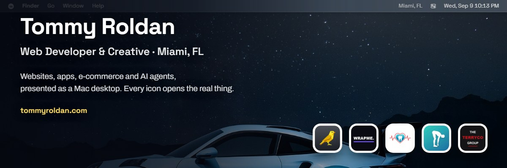
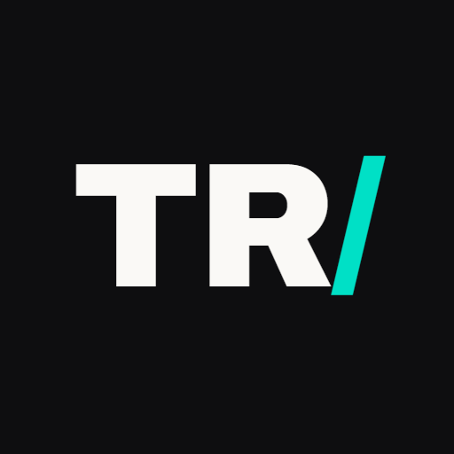
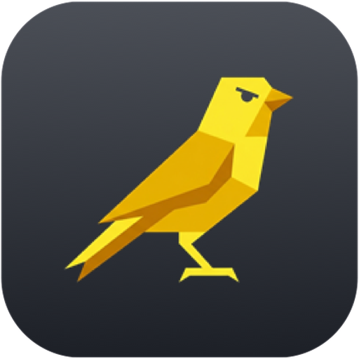
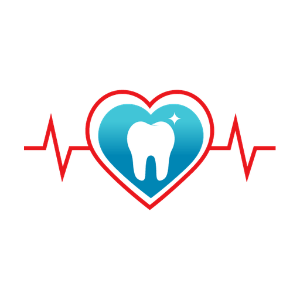
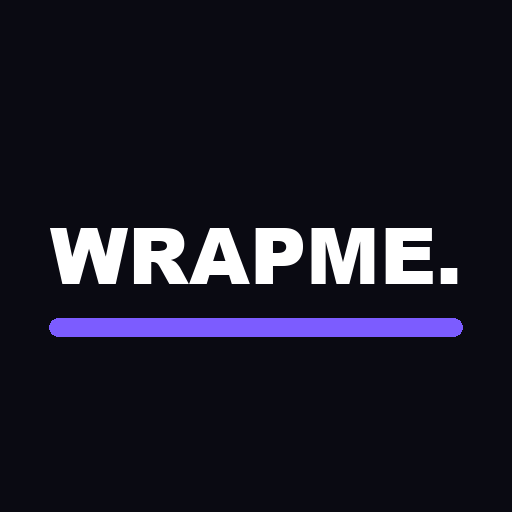

 

   

   

---

Developer and creative bridging business, sales and technology. Born in Medellín, raised on Key Biscayne, working out of Miami. Today I am CTO for TerryCo Group, NST Pharma, World Resort Rescue and Clear Care Dental Group, and Head of LATAM Sales at NST Pharma. Comfortable in a boardroom pitch and a codebase on the same afternoon, and I close in two languages.

My portfolio is not a grid of screenshots. It is a Mac desktop in the browser where every icon opens the real thing: **[tommyroldan.com](https://tommyroldan.com)**

## Things I have built

<table>
<tr>
<td width="76" align="center"></td>
<td>
<b><a href="https://tommyroldan.com">TommyOS</a></b> · <a href="https://github.com/TmasLove/Portfolio">source</a> 
My portfolio as a desktop operating system: windows, a dock, Launchpad, Spotlight, and an iPhone home screen on mobile. The wallpaper is shared, so whatever you pick is what the next visitor sees. Static HTML, CSS and JS, no framework and no build step.
</td>
</tr>
<tr>
<td width="76" align="center"></td>
<td>
<b><a href="https://github.com/TmasLove/Canary-release">Canary</a></b> · <a href="https://tommyroldan.com/canary/">about</a> 
Free Windows diagnostics that read what the hardware actually reports. I built it because Samsung's own utility called a drive "Good" while it sat on 252 unrecoverable read errors. It also finds the graphics hangs Windows records but never writes to Event Viewer, which is how a card that had frozen 51 times went unnoticed through nine driver versions and a shop bench test.
</td>
</tr>
<tr>
<td width="76" align="center"></td>
<td>
<b><a href="https://app.clearcaredentalgroup.com/login">Clear Care Dental</a></b> · <a href="https://clearcaredentalenterprise.com/">enterprise</a> 
Full-stack dental benefits platform in React Native and Expo. Members find in-network dentists, track plan usage in real time and book visits from one cross-platform app, with an enterprise dashboard behind it running benefits administration at scale.
</td>
</tr>
<tr>
<td width="76" align="center"></td>
<td>
<b><a href="https://wrapme.app">WrapMe</a></b> 
Real-time 3D configurator for vehicle wrap and paint shops. Customers orbit their own car in the browser and try real films across six independently painted zones, rendered live in WebGL.
</td>
</tr>
</table>

Also around here: [Repo-Guard](https://github.com/TmasLove/Repo-Guard), [KOM Memorial](https://github.com/TmasLove/kom-memorial) and [Local Legend Predictor](https://github.com/TmasLove/local-legend-predictor) for the Strava-obsessed, and [Brick Breaker](https://tmaslove.github.io/Brick-/), the first thing I ever shipped in JavaScript, still playable. Plus a ton more in private repos that soon enough may be public.

## Toolbox

           

## Off the keyboard

Fast cars, fixed bikes, and Armagetron, the light-cycles game I grew up on, which I rebuilt into the portfolio so you can play it there. Segments on [Strava](https://www.strava.com/athletes/14197229), lobbies on [Steam](https://steamcommunity.com/id/shlumplord/), and whatever is on repeat on [Apple Music](https://music.apple.com/profile/tmizle).

 
<b>Got a project, a beer, or an idea?</b>
  
<a href="https://tommyroldan.com/contact/">Start here</a> · <a href="mailto:hi@tommyroldan.com">hi@tommyroldan.com</a> · Miami, FL

